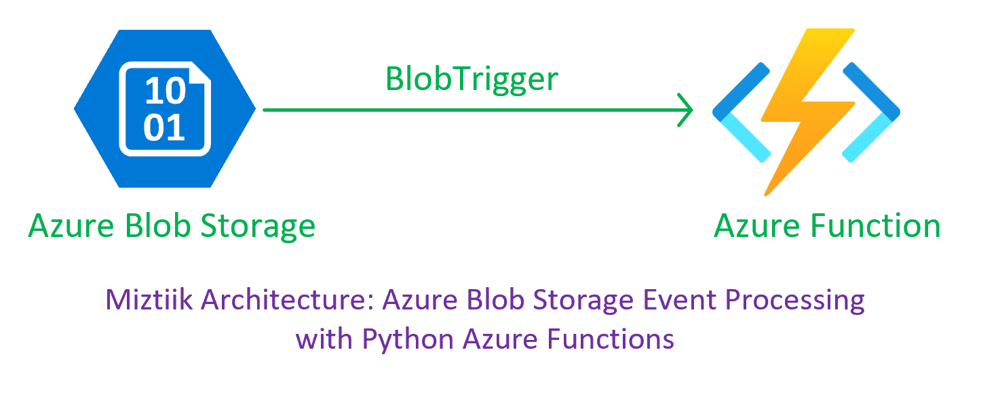
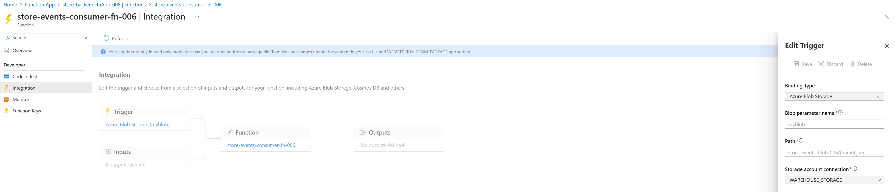
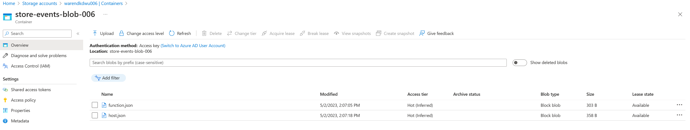
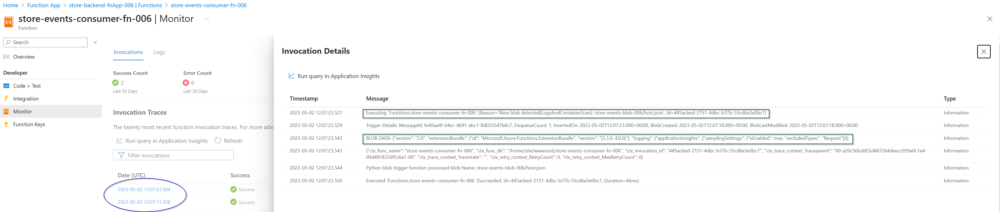

# Azure Blob Storage Event Processing with Python Azure Functions

The developers at Mystique Unicorn are looking to implement a serverless solution that can process incoming events triggered by updates to blob storage on Azure. They have heard of Azure capabitlities for event processing  can you help them


## 🎯 Solution

This solution provides a Python-based Azure Function that processes events triggered by updates to Azure Blob Storage. With all necessary resources provisioned in Bicep, deployment and management are made easy. Our "Azure Blob Storage Event Processing with Python Azure Functions" solution enables quick and efficient event processing on Azure, without the need for complex infrastructure management.

1. ## 🧰 Prerequisites

   This demo, instructions, scripts and bicep template is designed to be run in `westeurope`. With few or no modifications you can try it out in other regions as well(_Not covered here_).

   - 🛠 Azure CLI Installed & Configured - [Get help here](https://learn.microsoft.com/en-us/cli/azure/install-azure-cli)
   - 🛠 Bicep Installed & Configured - [Get help here](https://learn.microsoft.com/en-us/azure/azure-resource-manager/bicep/install)
   - 🛠 VS Code & Bicep Extenstions - [Get help here](https://learn.microsoft.com/en-us/azure/azure-resource-manager/bicep/install#vs-code-and-bicep-extension)

1. ## ⚙️ Setting up the environment

   - Get the application code

     ```bash
     https://github.com/miztiik/azure-send-custom-metrics-using-umi
     cd azure-send-custom-metrics-using-umi
     ```

1. ## 🚀 Prepare the environment

   Let check you have Azure Cli working with 

    ```bash
      # You should have azure cli preinstalled
      az account show
    ```

    You should see an output like this,

   ```json
    {
      "environmentName": "AzureCloud",
      "homeTenantId": "16b30820b6d3",
      "id": "1ac6fdbff37cd9e3",
      "isDefault": true,
      "managedByTenants": [],
      "name": "YOUR-SUBS-NAME",
      "state": "Enabled",
      "tenantId": "16b30820b6d3",
      "user": {
        "name": "miztiik@",
        "type": "user"
      }
    }
   ```

1. ## 🚀 Deploying the application

   - **Stack: Main Bicep**
     This will create the following resoureces
     - General purpose Storage Account with blob container
        - This will be used by Azure functions to store the function code
     - Storage Account with blob container - 
        - This will be used to store the events
     - Python Azure Function
        - Binding to the blob container for events


    ```bash
    # make deploy
    sh deployment_scripts/deploy.sh
    ```

    After successfully deploying the stack, Check the `Resource Groups/Deployments` section for the resources.

    


1. ## 🔬 Testing the solution

   - **Upload file to blob**

      Get the storage account and container name from the output of the deployment. Upload a file to the container and check the logs of the function app to see the event processing in action.

      Sample bash script to upload files to blob container. You can also upload manually from the portal,
      ```bash
      FILE_NAME="${RANDOM}_$(date +'%Y-%m-%d').json"
      SA_NAME="warendkdwu006"
      CONTAINER_NAME="store-events-blob-006"
      echo -n "{\"message\": \"hello world on $(date +'%Y-%m-%d')\"}" > ${FILE_NAME}
      az storage blob upload \
        --account-name ${SA_NAME} \
        --container-name ${CONTAINER_NAME} \
        --name ${FILE_NAME} \
        --file ${FILE_NAME} \
        --auth-mode login
      ```

      
      
  
     
1. ## 📒 Conclusion

    Here we have demonstrated trigger Azure functions with blob trigger. You can extend the solution and configure the function to send the events to other services like Event Hub, Service Bus, or persist them to Cosmos etc.
  

1. ## 🧹 CleanUp

If you want to destroy all the resources created by the stack, Execute the below command to delete the stack, or _you can delete the stack from console as well_

- Resources created during [Deploying The Application](#-deploying-the-application)
- _Any other custom resources, you have created for this demo_

```bash
# Delete from resource group
az group delete --name Miztiik_Enterprises_xxx --yes
# Follow any on-screen prompt
```

This is not an exhaustive list, please carry out other necessary steps as maybe applicable to your needs.

## 📌 Who is using this

This repository aims to show how to Bicep to new developers, Solution Architects & Ops Engineers in Azure.


### 💡 Help/Suggestions or 🐛 Bugs

Thank you for your interest in contributing to our project. Whether it is a bug report, new feature, correction, or additional documentation or solutions, we greatly value feedback and contributions from our community. [Start here](/issues)

### 👋 Buy me a coffee

[](https://ko-fi.com/Q5Q41QDGK) Buy me a [coffee ☕][900].

### 📚 References


1. [Azure Functions Python developer guide][1]
1. [host.json reference for Azure Functions 1.x][2]
1. [Azure Functions triggers and bindings concepts][3]
1. [Azure Functions Best Practices][4]
1. [Azure Blob storage trigger for Azure Functions][5]
1. [Azure Functions trigger on blob containers events][6]


[1]: https://learn.microsoft.com/en-us/azure/azure-functions/functions-reference-python?pivots=python-mode-configuration&tabs=asgi%2Capplication-level#triggers-and-inputs
[2]: https://learn.microsoft.com/en-us/azure/azure-functions/functions-host-json-v1?tabs=2x-durable-functions
[3]: https://learn.microsoft.com/en-us/azure/azure-functions/functions-triggers-bindings?tabs=python
[4]: https://learn.microsoft.com/en-us/azure/azure-functions/functions-best-practices
[5]: https://learn.microsoft.com/en-us/azure/azure-functions/functions-bindings-storage-blob-trigger?tabs=python-v2%2Cin-process&pivots=programming-language-python
[6]: https://learn.microsoft.com/en-us/azure/azure-functions/functions-event-grid-blob-trigger?pivots=programming-language-python
[7]: https://learn.microsoft.com/en-us/azure/azure-functions/deployment-zip-push


### 🏷️ Metadata


**Level**: 100


[100]: https://www.udemy.com/course/aws-cloud-security/?referralCode=B7F1B6C78B45ADAF77A9
[101]: https://www.udemy.com/course/aws-cloud-security-proactive-way/?referralCode=71DC542AD4481309A441
[102]: https://www.udemy.com/course/aws-cloud-development-kit-from-beginner-to-professional/?referralCode=E15D7FB64E417C547579
[103]: https://www.udemy.com/course/aws-cloudformation-basics?referralCode=93AD3B1530BC871093D6
[899]: https://www.udemy.com/user/n-kumar/
[900]: https://ko-fi.com/miztiik
[901]: https://ko-fi.com/Q5Q41QDGK